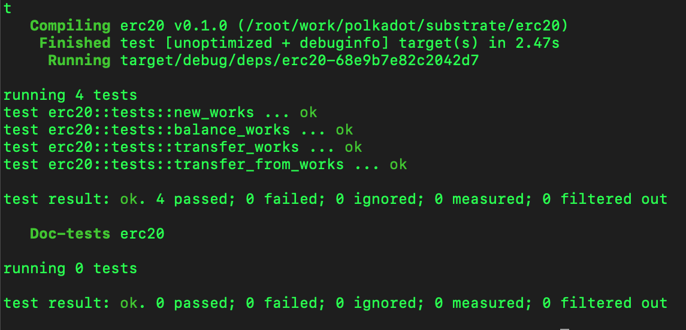
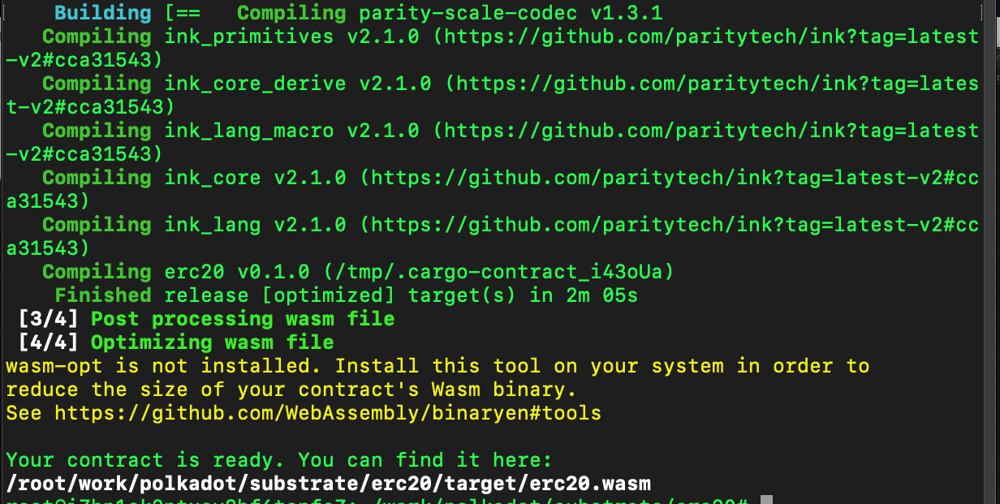
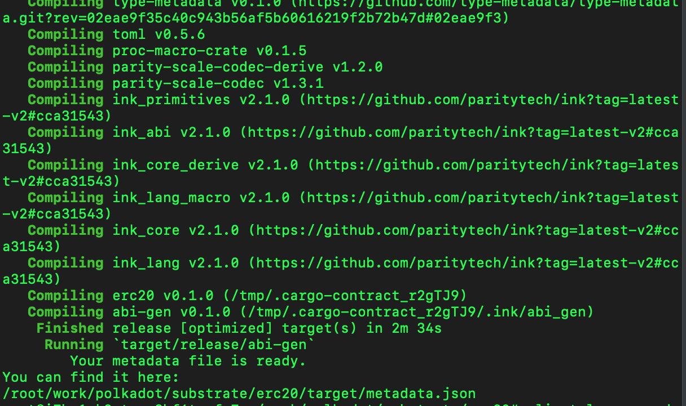
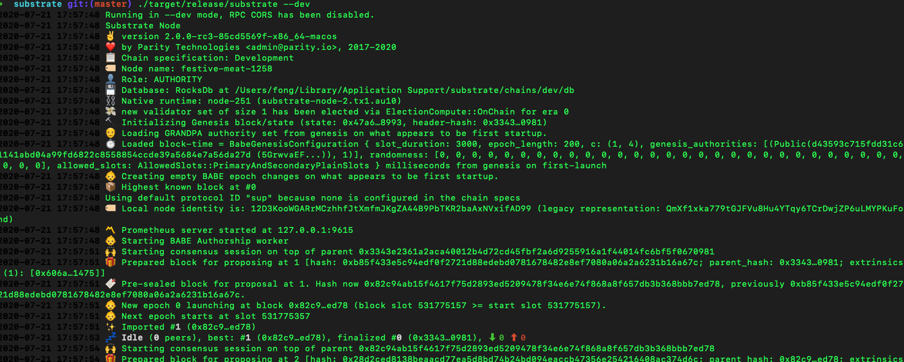
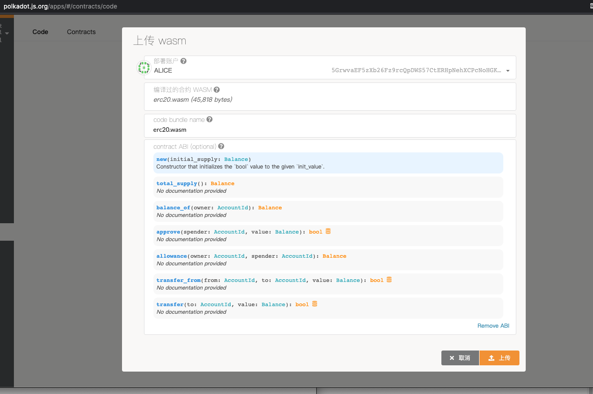
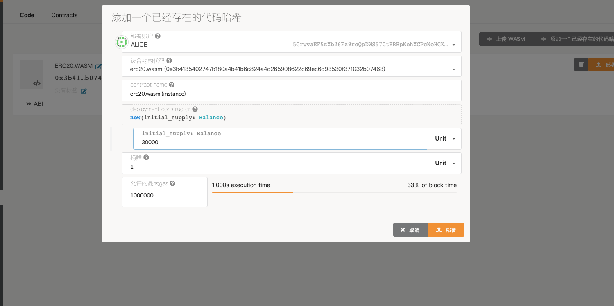
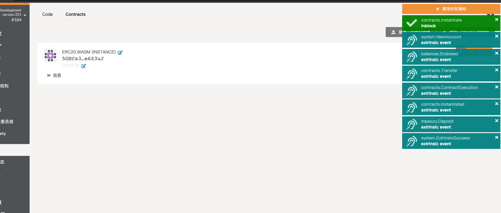
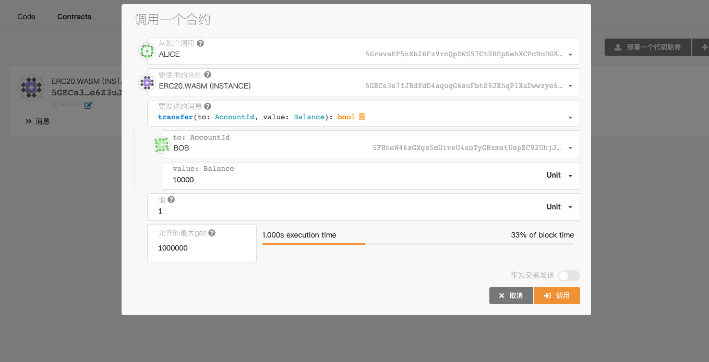
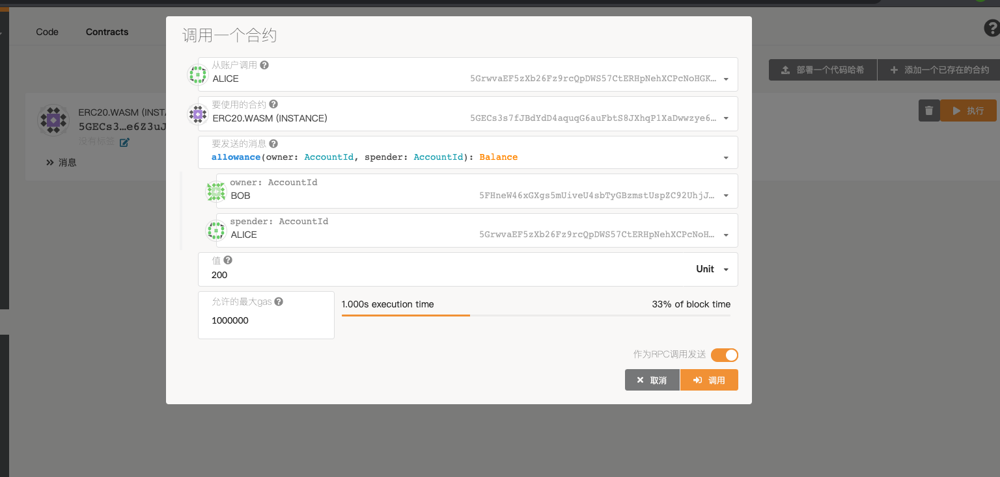

# lesson10
第10课作业区

````bash
curl https://getsubstrate.io -sSf | bash -s -- --fast
rustup target add wasm32-unknown-unknown --toolchain stable
rustup component add rust-src --toolchain nightly
cargo install node-cli --git https://github.com/paritytech/substrate.git --tag v2.0.0-rc4 --force

cargo contract new Erc20
cargo +nightly contract build
cargo +nightly contract generate-metadata
````

````bash
 ./target/release/substrate --dev
````





















Dont konw why cannot call the funtion correctly, I dont get the response when click the button.