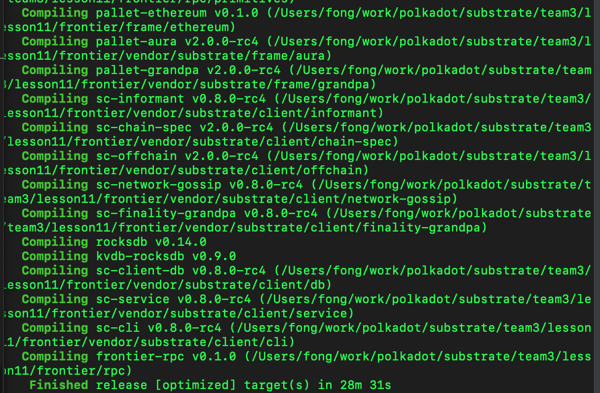
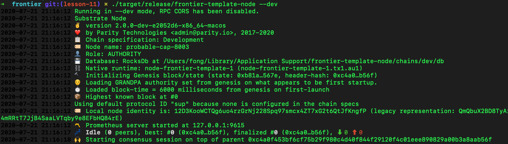
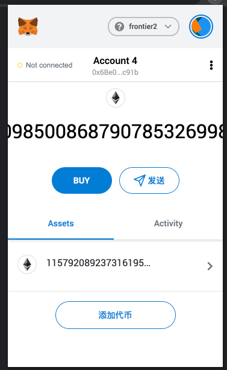
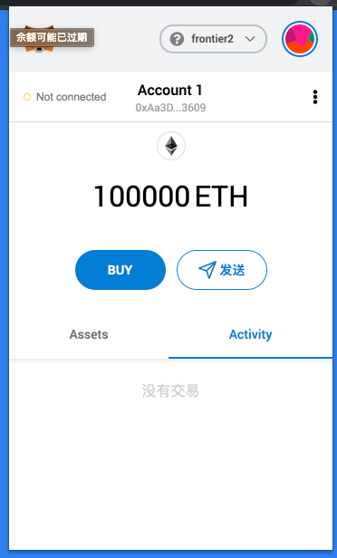
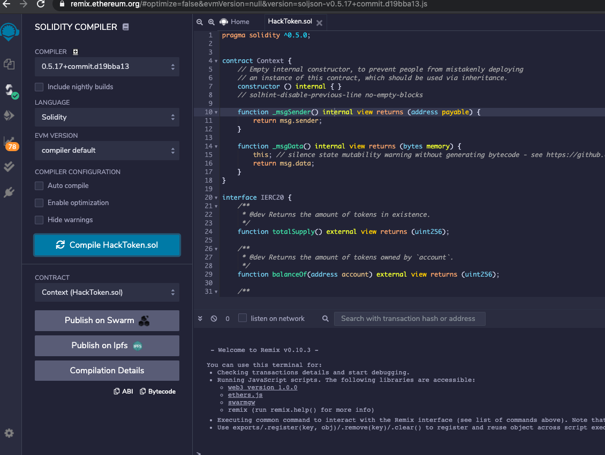
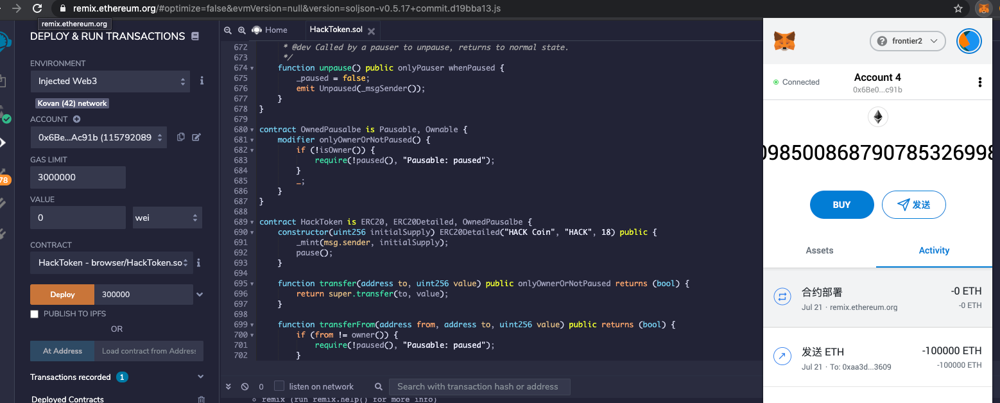
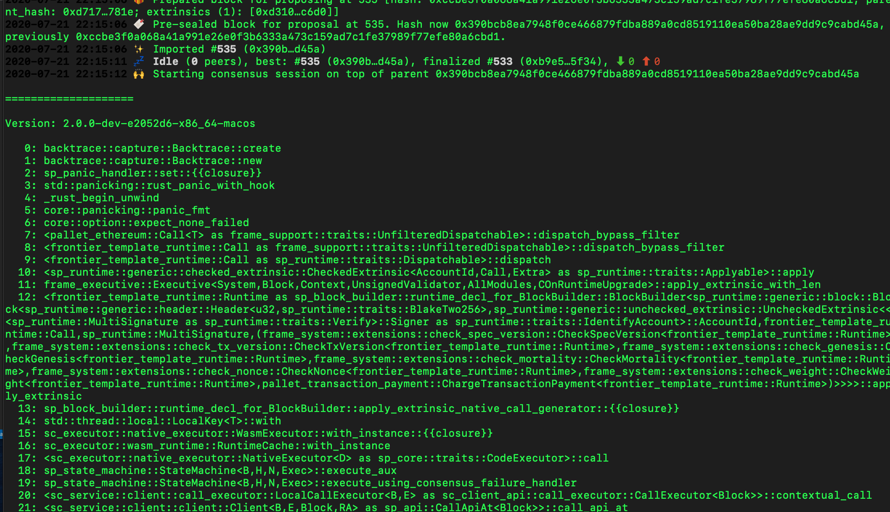

# Lesson11指令

## 操作账户

PrivateKey: `99B3C12287537E38C90A9219D4CB074A89A16E9CDB20BF85728EBD97C343E342`

Address: `0x6Be02d1d3665660d22FF9624b7BE0551ee1Ac91b`


## node启动

下载同路径下的`frontier.zip`文件到本地，并解压缩。

```bash
cd frontier
cargo build --release
```

启动节点：

```bash
cd frontier
./target/release/frontier-template-node purge-chain --dev
./target/release/frontier-template-node --dev
```

Compile frontier



frontier running ok



set metamask


get balance ok



transfer ether ok



https://remix.ethereum.org/
compile a Erc20 token on remix . ok



deply the contract



get an error when make a transaction



## 注意事项

gas limit: `4294967295`