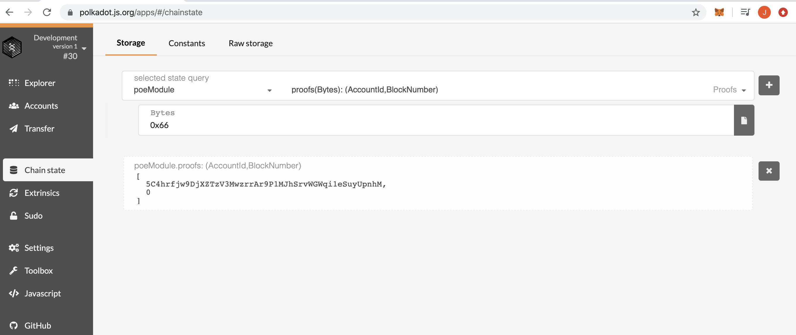
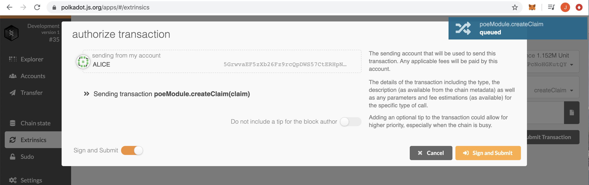
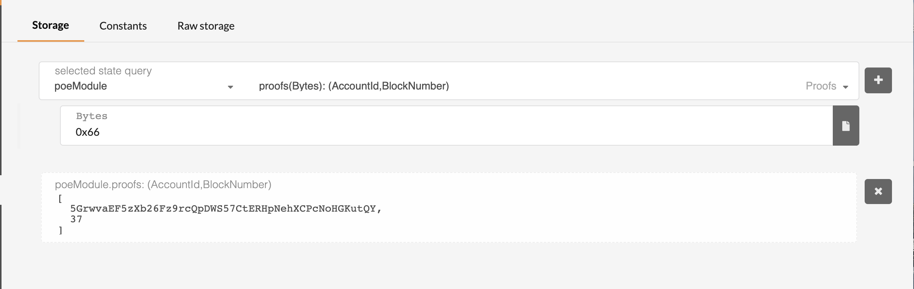
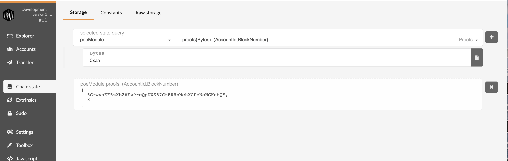

#### 第一题
* 创建存证，可调用函数所接收参数为内容的哈希值 Vec<u8>；
* 撤销存证，可调用函数所接收参数为内容的哈希值 Vec<u8>。

##### 创建

##### 删除

#### 第二题：为存证模块添加新的功能

* 转移存证，接收两个参数，一个是内容的哈希值，另一个是存证的接收账户地址；当存证不存在或者发送请求的用户不是存证内容的拥有人时，返回错误；当所有的检查通过后，更新对应的存证记录，并触发一个事件。

> 为alice创建存证 0xaa 并转移到bob，触发ClaimTransfered事件

