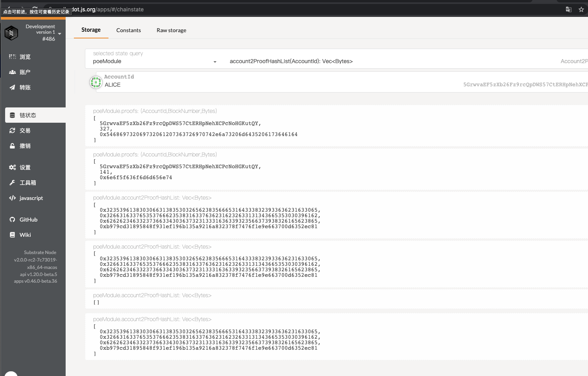
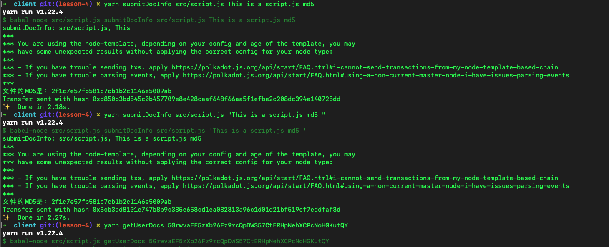
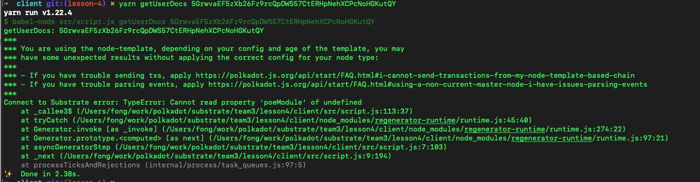

## 第四课作业

试在 [Substrate Front-end Template](https://github.com/SubstrateCourse/substrate-front-end-template) 或 node.js (node.js 则以命令行介面)，实现以下功能：

这一题是基于第三节课的第二题。之前 后端 有一个 map 从 文件的 hash 关联到 用户 AccountID。然在也要记录创建的时间，还有就是前端加个 text input 允许用户存证时输入一组不长于 256 字符串的备注。

如果不确定确用什么 hash 函数的话，可用用 @polkadot/util-crypto ([NPM](https://www.npmjs.com/package/@polkadot/util-crypto)，[github](https://github.com/polkadot-js/common/tree/master/packages/util-crypto)) 内的 [blake2](https://github.com/polkadot-js/common/tree/master/packages/util-crypto/src/blake2) 或 [sha512](https://github.com/polkadot-js/common/tree/master/packages/util-crypto/src/sha512)。

用 node. js 的话，则是写一个类似函数：

```javascript
// 取得 ApiPromise, 连到去远端 Substrate 节点的代码

function submitDocInfo(filePath, comment) {
  // 把 filePath 档档案通过 hash 函数算出它的 hash 值。然后用 Polkadot-JS API 提交个个 extrinsics 到 Substrate
}
```
结果： 


js api上传文件hash信息以及comment ok 


js api根据account取回信息仍有问题没解决，“Connect to Substrate error: TypeError: Cannot read property 'poeModule' of undefined”



附加题：这一题需要改动 前端 **及 Substrate 节点** 的代码。现在也加一个功能，允许前端输入一个 AccountID，遍历显示属于该用户的文件 hash, 其创建日期，及其备注

用 node.js 的话，则是写一个类似函数：

```javascript
// 取得 ApiPromise, 连到去远端 Substrate 节点的代码

function getDocInfoFromAddr(addr) {
  // 通过用户 addr, 取得他所有的创建文件的 hash及相关资料。返回值是：
  // [{
  //   docHash: ..., 
  //   createdOn: ..., 
  //   comment: ...
  // }, {}, ...]
}
```
