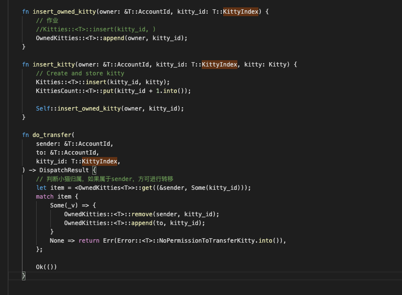
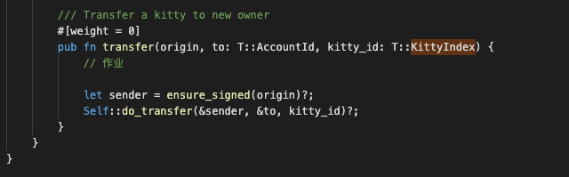
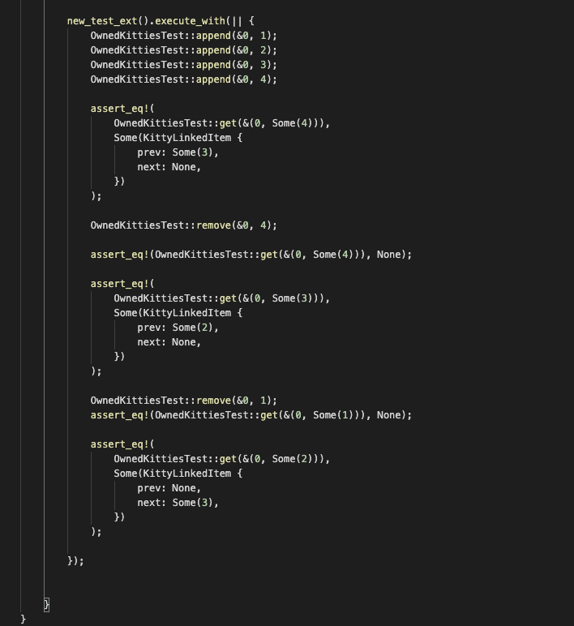
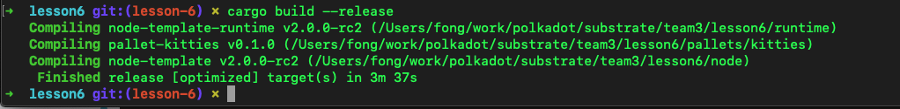
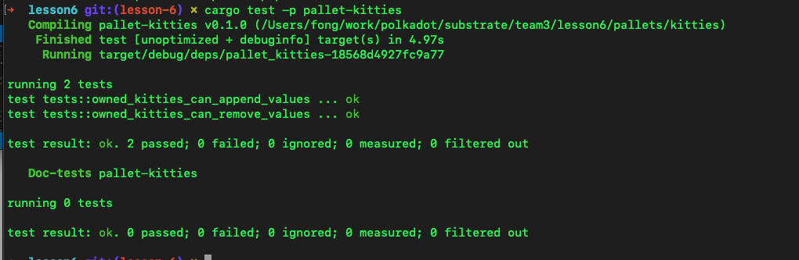

1. 补完剩下的代码 https://github.com/SubstrateCourse/substrate-kitties/blob/lesson6/pallets/kitties/src/lib.rs

编码

添加测试用例

编译ok

测试ok

2. 对比 pallet-asset 和 pallet-balances，简单分析下 pallet-asset 都有 哪些缺失的使得其不适合生产环境使用。
a. 注:以太坊的问题之一是状态爆炸

 pallet-asset仅仅演示用，功能上仅issue，transfer，balance等简单功能。 不能管理多资产，不能approve其他账号对本账号管理，不可以实现mint，burn等功能。 

3. 简单的分析下为什么 Polkadot 配置的 Balance 类型是 u128，而不是
类似以太坊的 u256。
a. 注:DOT 发行量是 1000 万个，精度是12位，年增发率是 10%

u128可以表示3乘10的28次方左右，除去12位精度位，还可以表示10的16次方，完全足够存放DOT数量。 

