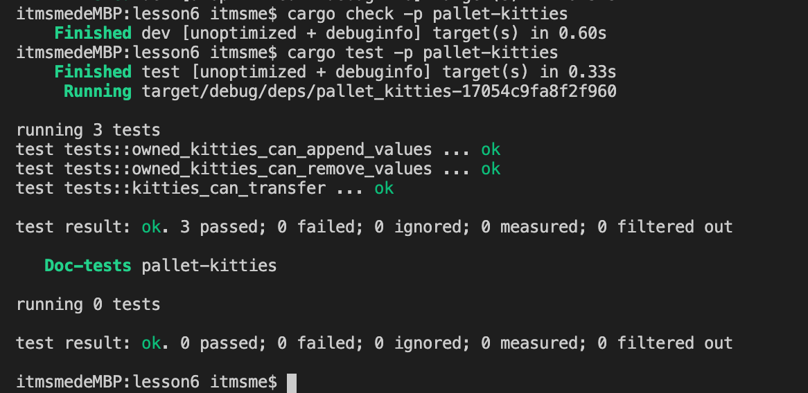

# 第六课作业答题卡

#### check and test

#### 一、对比 pallet-asset 和 pallet-balances, 简单分析下pallet-asset都有哪些缺失的使其不适合生产环境使用。(注：以太坊的问题之一是状态爆炸)
 
 1、pallet-asset是非常简单的多资产管理模块，而pallet-balances可以通过多个instance来实现多资产管理  
 2、pallet-asset缺少reserved和lock的功能 
 3、pallet-asset缺少尘埃账户删除功能,浪费链上资源占用。 
 4、pallet-asset缺少权重的设计 

#### 二、简单的分析下为什么Polkadot配置的Blance类型是u128，而不是类似以太坊的u256。（注： DOT发行量是1000万个，精度是12位，年增发量是10%）
1、Polkadot的经济模型设计可以得出类型u128完全够用，存储数据长度远远大于总发行量 1000万Dot以及每年10%的增发量而不溢出。而以太坊精度为18位，目前总发行量已经过亿，需要更大的数据类型u256 
2、在满足需求的情况下，Polkadot更节约节约链上存储空间，使用u128能比u256少暂用存储空间。 