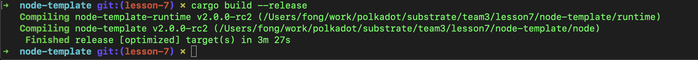
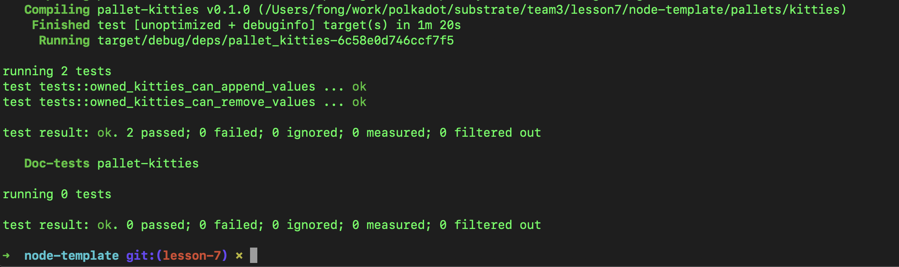

# lesson7 作业

1. 补完剩下的代码  
https://github.com/SubstrateCourse/substrate-kitties/blob/lesson7/pallets/kitties/src/linked_item.rs

见修改代码.txt 以及node-template提交
````bash
cargo build --release
cargo test -p pallet-kitties
````


2. 修复单元测试   
修改代码同以上文件


3. 阅读 pallet-membership     
    - a. 分析 add_member 的计算复杂度   
      binary_search的复杂度：O()=O(logn)
      T::MembershipChanged::change_members_sorted复杂度： Vec的sort复杂度: nlogn
    - b. 分析 pallet-membership 是否适合以下场景下使用，提供原因   
      * i. 储存预言机提供者    
      * ii. 储存游戏链中每个工会的成员   
      * iii. 储存 PoA 网络验证人   
      i， iii情况适合，参与者个数相对比较少，