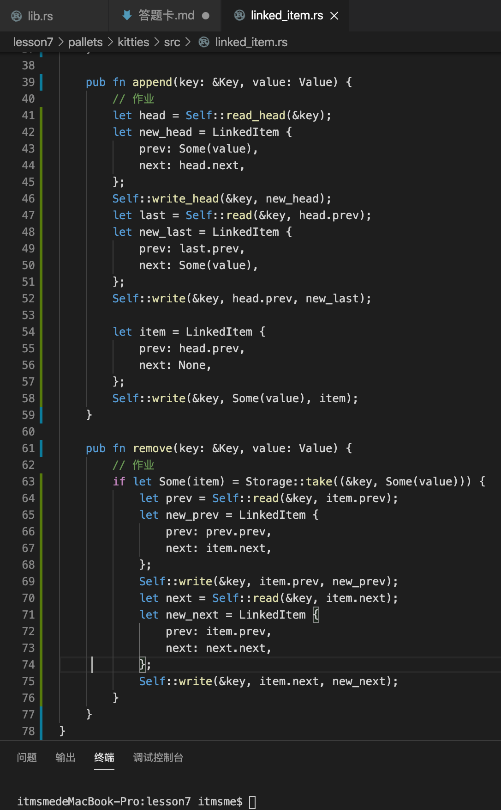
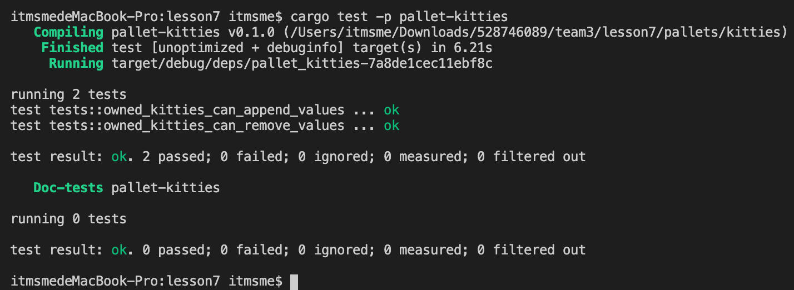

# lesson7 作业

1. 补完剩下的代码  
https://github.com/SubstrateCourse/substrate-kitties/blob/lesson7/pallets/kitties/src/linked_item.rs

2. 修复单元测试  
 

3. 阅读 pallet-membership     
    - a. 分析 add_member 的计算复杂度   
    - b. 分析 pallet-membership 是否适合以下场景下使用，提供原因   
      * i. 储存预言机提供者 
       
      pallet-membership适合储存预言机提供者。
     
      * ii. 储存游戏链中每个工会的成员 
     
      pallet-membership不适合适合储存游戏链中每个工会的成员，每个工会由大量成员组成，并且有较复杂的组织结构，pallet-membership只提供简单的会员储存结构，因此不适合。

      * iii. 储存 PoA 网络验证人 

      pallet-membership适合储存 PoA 网络验证人，pallet-membership本身提供简单的成员储存模块，POA权威共识多用于少量的网络验证人，因此可以pallet-membership储存成员。