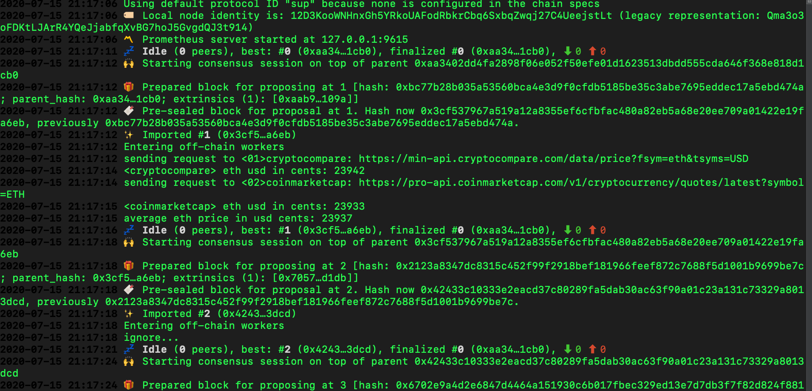
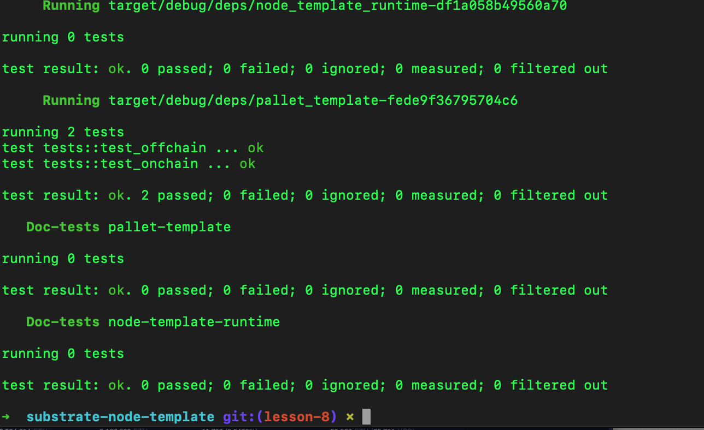

## 第九课作业

**(7 分)**

利用 off-chain worker，试从两个或以上的加密货币价格提供者 (最少两个)，透过其 API 取得 ETH 币的价格，
取其平均值，然后把它推 (append) 到 ocw 链下储存的 Vec 内。

加密货币价格提供者包括以下：
  - https://coinmarketcap.com/
  - https://coincap.io/
  - https://www.cryptocompare.com/
  - 其他你自己找到的提供者也可以

```bash
./target/release/node-template purge-chain --dev
./target/release/node-template --dev
```

Running


Still have a bug to solve.

Can not submit price successfully.

Just get this.

Prepared block for proposing at 451 [hash: 0x09c47771096fd1aac2eeba397f43969103fa8e1a0a5e378f978fff7ac63f9ea6; parent_hash: 0xcfb5…b73a; extrinsics (1): [0x05b3…3665]]
2020-07-15 22:02:12 🔖 Pre-sealed block for proposal at 451. Hash now 0x93611ece381dac34b93fdd3924a89168beac511faa422204a433c87b6d1c90a0, previously 0x09c47771096fd1aac2eeba397f43969103fa8e1a0a5e378f978fff7ac63f9ea6.


**(3 分)** 

附加题：为你的 ocw 写单元测试
Test One


One Remains Empty